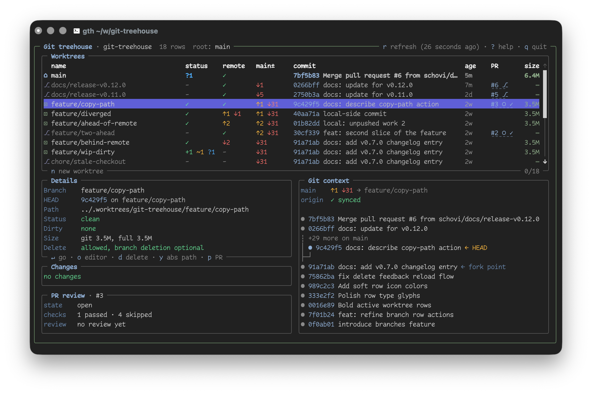

<p align="center">
  
</p>

<h1 align="center">Git Treehouse</h1>

<p align="center">
  <strong>Git Treehouse - Tame AI agent worktrees</strong>
</p>

<p align="center">
  When agents create branches and worktrees faster than you can track them, Git Treehouse gives you one keyboard-driven view to inspect, jump, clean up, and create the next worktree safely.
  Use `git-treehouse` as the native CLI, or `gth` after shell integration for directory-changing workflows.
</p>

<p align="center">
  <a href="https://github.com/schovi/git-treehouse/actions/workflows/ci.yml"></a>
  <a href="https://github.com/schovi/git-treehouse/releases"></a>
  <a href="LICENSE"></a>
</p>

<p align="center">
  
</p>

<p align="center">
  More screenshots:
  <a href="docs/assets/screens/screen-onboarding.png">onboarding</a> |
  <a href="docs/assets/screens/screen-app-2.png">app example #2</a> |
  <a href="docs/assets/screens/screen-new-worktree.png">create new worktree</a>
  <a href="docs/assets/screens/screen-new-worktree-from-branch.png">create new worktree</a>
  <a href="docs/assets/screens/screen-help.png">create new worktree</a>
</p>

## What It Does

| | Feature |
| --- | --- |
| ✅ | List every worktree for the repository containing your current directory. |
| ✅ | Show local branches that have no worktree, and create or checkout from them. |
| ✅ | Jump your shell into the selected worktree with the `gth` shell wrapper. |
| ✅ | Create a new branch and worktree from the focused row, with the target path previewed before creation. |
| ✅ | Delete worktrees with guardrails for active, main, dirty, and unmerged branches, and restore a just-deleted branch with `u`. |
| ✅ | Search branches with `s`, filter worktree states with `Tab`, and run any action from the `Ctrl+P` command palette. |
| ✅ | See dirty counts, upstream sync, main comparison, commit age, disk size, PR, and CI state in one table. |
| ✅ | Drill into the selected row with context frames below the table: a PR review roll-up, a per-file changes summary, and a Git context graph. |
| ✅ | Auto-refresh local Git state while idle, with `git fetch --prune` only when you ask for it. |
| ✅ | Per-repo `.worktree` config: path template overrides, copied files, and approved create/delete hooks. |
| ✅ | Open a worktree in your editor, copy paths, or use `git-treehouse list` for non-interactive output. |

## Install

Install with Homebrew:

```sh
brew install --cask schovi/tap/git-treehouse
```

Homebrew installs the native `git-treehouse` binary and the short `gth` command. With the binary on `PATH`, Git can also run it as `git treehouse`.

Install from GitHub with Go:

```sh
go install github.com/schovi/git-treehouse/cmd/git-treehouse@latest
```

Or from a local checkout:

```sh
go install ./cmd/git-treehouse
```

Go installs the `git-treehouse` binary.

Optional dependency:

- `gh`, authenticated with GitHub, enables PR and CI status.

## First Run

Run `git-treehouse` inside a Git repository or any of its worktrees:

```sh
git-treehouse
```

On first launch, `git-treehouse` may show a shell integration setup screen. Install it if you want `Enter` to change your shell directory to the selected worktree.

After shell integration is installed, use `gth` for directory-changing runs. Keep using `git-treehouse` for native commands like `git-treehouse list` and `git-treehouse init`.

Without shell integration, `git-treehouse` can still print the selected path:

```sh
cd "$(git-treehouse)"
```

## Shell Integration

A child process cannot change the parent shell directory directly. Git Treehouse solves this with a small `gth` shell wrapper: the TUI writes the selected path to a temporary file, then the wrapper reads it and runs `cd`.

`git-treehouse init` installs shell functions for `gth`. It does not replace the native `git-treehouse` binary. Use `gth` when you want the selected worktree to become your current directory.

The first-run setup screen can install this for you. You can also install it manually.

Load integration for the current shell session:

```sh
eval "$(git-treehouse init)"
```

`git-treehouse init` auto-detects your shell when it can. Pass a shell name explicitly if detection is wrong or unavailable.

Fish:

```fish
git-treehouse init fish | source
```

Persistent setup examples:

```sh
git-treehouse init zsh >> ~/.zshrc
git-treehouse init bash >> ~/.bashrc
git-treehouse init sh >> ~/.profile
git-treehouse init ksh >> ~/.kshrc
```

Fish:

```fish
mkdir -p ~/.config/fish/functions
git-treehouse init fish > ~/.config/fish/functions/gth.fish
```

Nushell:

```nu
mkdir ~/.config/nushell/autoload
git-treehouse init nushell | save --force ~/.config/nushell/autoload/gth.nu
```

PowerShell:

```powershell
$module = New-Item -ItemType Directory -Force ~/.local/share/powershell/Modules/GitTreehouse
git-treehouse init powershell > (Join-Path $module.FullName GitTreehouse.psm1)
New-ModuleManifest -Path (Join-Path $module.FullName GitTreehouse.psd1) -RootModule GitTreehouse.psm1 -ModuleVersion 1.0.0 -FunctionsToExport gth -CmdletsToExport @() -AliasesToExport @() -VariablesToExport @() -Force
```

The first-run installer does this for you. Create parent config directories first if your shell has not created them yet.

Supported shells:

| Shell | Init command |
| --- | --- |
| zsh | `git-treehouse init zsh` |
| bash | `git-treehouse init bash` |
| fish | `git-treehouse init fish` |
| sh / dash | `git-treehouse init sh` |
| ksh | `git-treehouse init ksh` |
| Nushell | `git-treehouse init nushell` |
| PowerShell | `git-treehouse init powershell` |

Restart the shell, or source the config file after installation.

## Common Workflows

### Jump To A Worktree

1. Run `gth` after shell integration is installed.
2. Move with `up` / `down`, or `k` / `j`.
3. Press `Enter`.

Your shell moves into the selected worktree. Without shell integration, run `git-treehouse` as the native TUI and use the printed path with `cd`.

### Create A Worktree

1. Focus the row you want to branch from.
2. Press `n`.
3. Type a new branch name.
4. Use `Tab`, `shift+tab`, `up`, or `down` to choose the base.
5. Press `Enter`.

The popup shows the resolved path before creation.

Default path:

```text
{repo_parent}/.worktrees/{repo_name}/{branch}
```

Example:

```text
Repo:   /Users/me/work/api
Branch: feature/login
Path:   /Users/me/work/.worktrees/api/feature-login
```

To change where new worktrees go, press `ctrl+o` in the create popup. This opens `~/.config/git-treehouse/config.toml`. Save the file and `git-treehouse` reloads it while the popup is still open.

### Checkout A Pull Request

1. Press `Ctrl+P` to open the command palette.
2. Run `Checkout PR`.
3. Type to filter the list (PR number, title, URL, owner, or branch).
4. Move with `up` / `down` (or `k` / `j`).
5. Press `Enter` to check the PR out into a worktree, or `o` to open it in the browser.

The picker loads up to 200 pull requests via `gh` (open, draft, merged, and closed). `Enter` reuses an existing worktree or branch when present, otherwise it fetches the PR head and creates a new worktree. On success your shell moves into the worktree. This flow is available from the palette only; there is no dedicated key.

### Delete A Worktree

1. Focus a worktree row.
2. Press `d`, `Delete`, or `Backspace`.
3. Review the delete dialog.
4. Press `Enter`.

Active and main worktrees cannot be deleted from the TUI. Dirty or unmerged deletion requires explicitly arming force.

### Clean Up Merged

The `Clean up merged` palette command removes done worktrees and branches in one batch. Open the palette with `Ctrl+P` and run `Clean up merged`. It scans every row regardless of the current filter or search and proposes removing worktrees (or branch-only rows) merged into main, plus worktrees whose PR is merged or closed.

The confirmation dialog shows counts, representative affected rows, and the exact commands. It stays conservative: worktree removal uses `git worktree remove` (never `--force`) and branch deletion uses `git branch -d` (never `-D`). Dirty, locked, active, root, detached, and prunable rows are skipped, and branches are deleted only when merged into main. When deleted branch refs have known SHAs, the success message offers `u` to restore them.

### Refresh State

`git-treehouse` refreshes local Git state automatically while idle.

Use `r` to run:

```sh
git fetch --prune
```

Then `git-treehouse` reloads the table.

## Keybindings

| Key | Action |
| --- | --- |
| `up` / `down`, `k` / `j` | Move selection |
| `g` / `G` | Jump to top / bottom |
| `h` | Jump to the root repository worktree |
| `a` | Jump to active worktree |
| `Enter` | Go to selected worktree and exit; on a branch-only row, create a worktree for that branch and go |
| `n` | Create a new worktree from the focused row |
| `c` | On a branch-only row, checkout that branch in the root worktree |
| `d`, `Delete`, `Backspace` | Delete focused worktree or branch |
| `u` | Restore the just-deleted branch |
| `o` | Open selected worktree in editor |
| `p` | Open selected PR or branch page with `gh` |
| `y` | Copy selected worktree absolute path, or a branch-only row's branch name |
| `r` | Run `git fetch --prune` and reload |
| `s` | Search branches |
| `b` | Toggle branch-only rows (persists the setting) |
| `Tab` | Open the filter picker |
| `Ctrl+P` | Open the command palette |
| `Ctrl+O` | Open the config file in your editor |
| `Esc` | Close dialog, clear search, or clear the active filter (does not quit) |
| `?` | Toggle help |
| `q`, `Ctrl+C` | Quit |

Create popup:

| Key | Action |
| --- | --- |
| text | Type branch name |
| `left` / `right` | Move branch-name cursor |
| `Tab`, `down` | Next base |
| `shift+tab`, `up` | Previous base |
| `ctrl+o` | Open `git-treehouse` config |
| `Enter` | Create worktree |
| `Esc` | Cancel |

## Configuration

Configuration is optional. Defaults work without a config file.

Path:

```text
~/.config/git-treehouse/config.toml
```

Example:

```toml
editor = "cursor"
path_template = "~/.worktrees/{repo_name}/{branch}"
main_branch = ""
show_branches = false
skip_shell_integration_welcome = false
```

Options:

| Option | Default | Description |
| --- | --- | --- |
| `editor` | `$EDITOR`, then `code` | Command used by `o` and config editing |
| `path_template` | `{repo_parent}/.worktrees/{repo_name}/{branch}` | New worktree path template |
| `main_branch` | auto-detected | Override main branch detection |
| `show_branches` | `false` | Show branch-only rows on startup (also toggled with `b`) |
| `skip_shell_integration_welcome` | `false` | Do not show first-run shell setup |

Path template placeholders:

| Placeholder | Meaning |
| --- | --- |
| `{repo}` | Main worktree path |
| `{repo_name}` | Main worktree directory name |
| `{repo_parent}` | Parent directory of the main worktree |
| `{branch}` | Branch name sanitized for paths |

Notes:

- `~` at the start of `path_template` expands to your home directory.
- Relative templates are resolved from the main worktree path.
- Branch sanitization replaces path separators and whitespace with `-`.
- If your config still contains the old exact default `{repo_parent}/{branch}`, `git-treehouse` treats it as the current default.

### Repo-Scoped Configuration

Commit a `.worktree` TOML file at the repository root to apply settings to that repo and all of its worktrees. It is optional and layers on top of the global config.

```toml
# Overrides the global path_template for this repo only.
path_template = "{repo_parent}/.worktrees/{repo_name}/{branch}"

# Repo-relative files copied from the root repository into each new worktree.
copy_untracked = [".env", ".env.local"]

# Lifecycle hooks. These run only after you approve them (see below).
post_create = "npm install"      # runs after a new worktree is created
before_delete = "docker compose down"  # runs before a worktree is removed
```

| Key | Type | Behavior |
| --- | --- | --- |
| `path_template` | string | Overrides the global `path_template` for new worktrees in this repo. |
| `copy_untracked` | array | Repo-relative files copied from the root repository into each new worktree. Missing files, directories, and paths that escape the repo are skipped. |
| `post_create` | string | Command run after a new worktree is created and `copy_untracked` files are copied. |
| `before_delete` | string | Command run before a worktree is removed, when enabled in the delete dialog. |

Hooks (`post_create`, `before_delete`) are executable commands, so they require explicit approval:

```sh
git-treehouse allow
```

This records the current hook strings in repo-local Git config (`treehouse.approvedHash`). Hooks run only while the approval matches. If they are absent, changed, or unapproved, they are skipped silently and worktree create/delete continue without them. Changing `path_template` or `copy_untracked` does not invalidate approval. Hooks always run through POSIX `sh -c` in the target worktree directory. Run `git-treehouse doctor` to see recognized `.worktree` keys and hook approval state.

## Commands

Interactive TUI:

```sh
git-treehouse
gth
```

Print a plain table:

```sh
git-treehouse list
```

Skip GitHub lookup:

```sh
git-treehouse list --no-github
```

Load a specific repo or worktree:

```sh
git-treehouse list --json --repo ~/code/project-worktree
```

Check your environment and repo `.worktree` setup:

```sh
git-treehouse doctor
```

Approve the current repo `.worktree` hooks:

```sh
git-treehouse allow
```

Print shell integration:

```sh
git-treehouse init
git-treehouse init fish
git-treehouse init zsh
```

Print help:

```sh
git-treehouse -h
git-treehouse help
git-treehouse help list
```

## GitHub Integration

If `gh` is installed and authenticated, `git-treehouse` loads PR data in the background:

- PR number
- PR state
- CI status
- terminal hyperlinks where supported

When a row is selected, the PR review frame below the table drills further: a state/checks/reviews roll-up, individual failing or running checks, change-request previews, and inline review threads, each a terminal hyperlink. It loads lazily per selected row and stays visible with a loading placeholder for open PRs.

If `gh` is missing or unauthenticated, PR columns stay hidden or pending without noisy errors.

The `Checkout PR` palette command also uses `gh` to list pull requests and check one out into a worktree. See [Checkout A Pull Request](#checkout-a-pull-request).

## Troubleshooting

### Pressing Enter Only Prints A Path

Shell integration is not active in that terminal.

Run this for the current session:

```sh
eval "$(git-treehouse init)"
```

For fish:

```fish
git-treehouse init fish | source
```

Then install the integration persistently using the commands in [Shell Integration](#shell-integration).

### The First-Run Setup Screen Does Not Show

Check:

```toml
skip_shell_integration_welcome = false
```

in:

```text
~/.config/git-treehouse/config.toml
```

### New Worktree Path Looks Wrong

Open the create popup with `n`, then press `ctrl+o` to edit config. Change `path_template`, save the file, and the popup path preview reloads automatically.

Common templates:

```toml
path_template = "{repo_parent}/.worktrees/{repo_name}/{branch}"
path_template = "~/.worktrees/{repo_name}/{branch}"
path_template = "{repo}/worktrees/{branch}"
```

### PR Data Does Not Show

Check that GitHub CLI is installed and authenticated:

```sh
gh auth status
```

You can always skip PR lookup:

```sh
git-treehouse list --no-github
```

## Behavior Notes

- `git-treehouse` does not run `git fetch` on startup.
- Local Git state auto-refreshes while idle.
- `r` runs `git fetch --prune`.
- Bare worktree entries are not navigable rows.
- The main worktree is pinned first.
- Remaining worktrees are sorted by last commit time, newest first.
- Active and main worktrees cannot be deleted from the TUI.
- Dirty delete and unmerged branch deletion require explicit force arming.

## Development

Run tests:

```sh
go test ./...
```

Build:

```sh
go build ./cmd/git-treehouse
```

Smoke checks:

```sh
git-treehouse list --no-github
COLUMNS=80 git-treehouse list --no-github
git-treehouse init zsh
git-treehouse init fish
```

## Status

`git-treehouse` is young but usable software, focused on local, single-repository worktree management. See [`CHANGELOG.md`](CHANGELOG.md) for what shipped in each release.
